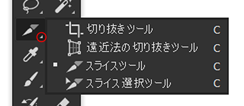
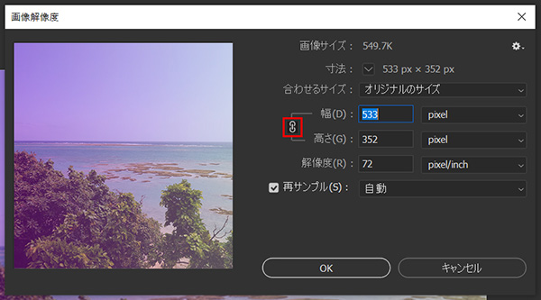

## ツール編

### 移動ツール

```
V

画像やテキスト、図形をドラッグして移動させるツールです。
「Shift」を押しながらドラッグすることで水平・垂直方向に移動する事が可能です。
また、「Alt（option）」を押しながら画像等をドラッグする事でコピーも出来ます。便利！

```

### 長方形選択ツール

```
M

ドラッグする事で選択範囲を作成出来るツールです。
マージンを測るのにも使えます。
他にも、楕円形、1行選択等の種類があります。
```

### スライスツール

```
C

コーダーお馴染みスライスツールです。
ドラッグする事で画像を書き出す為のスライスを作成出来ます。
```

### スライス選択ツール

```
C

作成したスライスのサイズを変更したり、書き出し時のファイル名を指定できます。
スライスツールとグループになっているのでスライスツールのアイコンを長押しするか、
「Shift」を押しながらCを押してツールを切り替えます。
また、スライスツールを使用中に「Ctrl（macは⌘）」を押している間もスライス選択ツールを使用できます。
```

### グループ内のツールを切り替え

ツールのアイコンの右下に三角形のアイコンがあるものは、複数のツールがグループになっています。<br>
アイコンを長押ししてグループを開いてツールを選択する事も出来ます。<br>
ショートカットで切り替えた場合、グループの上から順番にツールが切り替わります。



```
Ctrl（⌘） + [ツールのショートカットキー]
```

### 塗りつぶしツール

```
G

クリックした部分を描画色で塗りつぶします。
```

### スポイトツール

```
I

クリックした部分の色を抽出出来るツール。
たまーに使います。
```

## 操作編

### 保存

```
Ctrl（⌘） + S
```

### 別名で保存

```
Ctrl（⌘） + Shift + S
```

### web用に保存

スライスの保存に使います。
リサイズした画像をササっと保存する時にも。

```
Ctrl（⌘） + Alt（option） + Shift + S
```

### 操作の取り消し、やり直し

```
取り消し
Ctrl（⌘） + Z

やり直し
Ctrl（⌘） + Shift + Z
```

### ズームツール、画面サイズに合わせる

画面の拡大・縮小に使います。
オプションバーの「スクラブズーム」にチェックを入れたら、右にドラッグでズーム、<br>左にドラッグでズームアウト。

ズームしすぎて何がなんだか分からなくなったら「画面サイズに合わせる」！

また、ズームツールを選択していなくても、Alt（option） + マウスホイールでズーム・ズームアウトも出来ます。

```
ズームツール
Z

画面サイズに合わせる
Ctrl（⌘） +　0
```

### レイヤーをグループ化

複数のレイヤーを選択してグループに纏める事が出来ます。
アセットを利用して画像を書き出す際に重宝します。

```
Ctrl（⌘） +　G
```

### 画像解像度を変更

解像度を変更する他、リサイズにも使えます。
腰が抜けるようなサイズの画像を支給されても安心です。



```
Ctrl（⌘） + Alt（option） + I
```

### 新規レイヤーを作成

```
Ctrl（⌘） + Shift + N
```

### 新規ドキュメントを作成

```
Ctrl（⌘） + N
```

### ドキュメントを閉じる

```
Ctrl（⌘） + W
```

## まとめ
今回はよく使うショートカット集でした。<br>
今回紹介したのはデフォルトのショートカットキーですが、自分でオリジナルのショートカットキーを設定することもできます。

また、ショートカットキーはWindowsやchrome、XD等でも同じ意味合いで使われている事が多いので、<br>
1つ覚えれば他のアプリでも同じ感覚で操作できます。

ショートカットキーを覚えるだけで、普段の作業がかなり楽になりますので、ぜひ覚えてください。

