## スライスって何？
スライスとは、1枚の画像を分割して書き出す事の出来るツールです。 
ガイドラインを引いてスライスを一括で指定したり、任意のサイズで画像を書き出す事も出来ます。

### スライスをしてみよう

例えば、次のような画像をスライスを使って書き出してみましょう。 
長方形は単体。円は2つセットで書き出したいです。

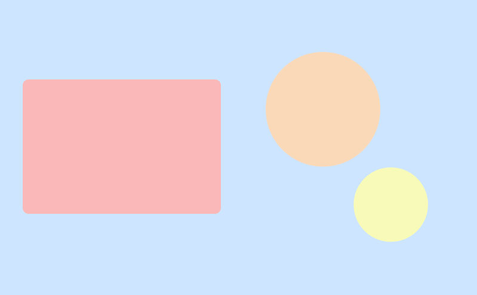

まずはスライスツールに切り替えましょう。 
赤枠で囲っているのがスライスツールです。 
切り抜きツールが選択されている場合は、アイコンを長押ししてツールを選択するか、Shift+Cでツールを切り替えます。

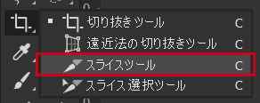

スライスツールに切り替えたら、長方形をスライスしたいと思います。 
長方形に沿ってドラッグしてみましょう。

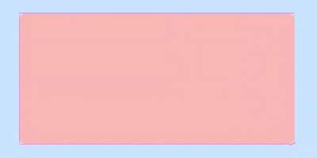

ドラッグすると、下記のような表示になるはずです。 
左上に青いアイコンが付いているのが自分が作成したスライス、グレーのアイコンは自動で作成されたスライスになります。

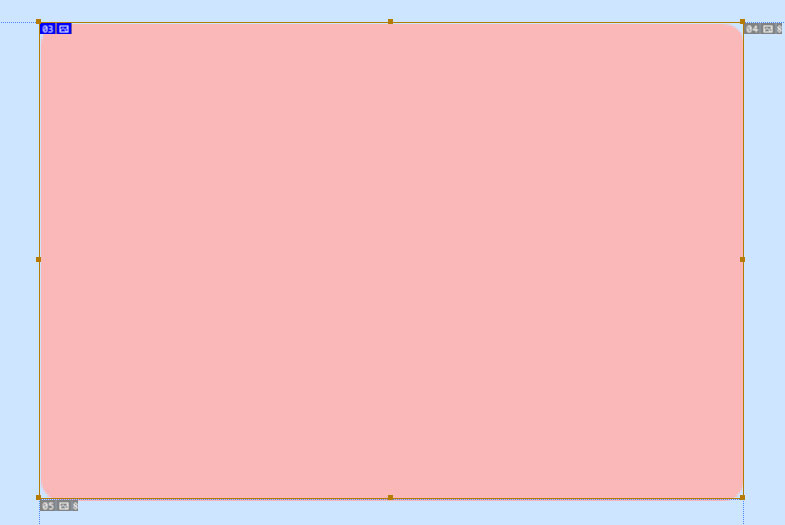

まずはこの長方形をjpgで保存しましょう。 
スライスツールを選択している状態で「Ctrl（⌘）」を押したままにすると「スライス選択ツール」に切り替わります。 
その状態で作成したスライスをダブルクリックして、スライスオプションのウィンドウを開きます。

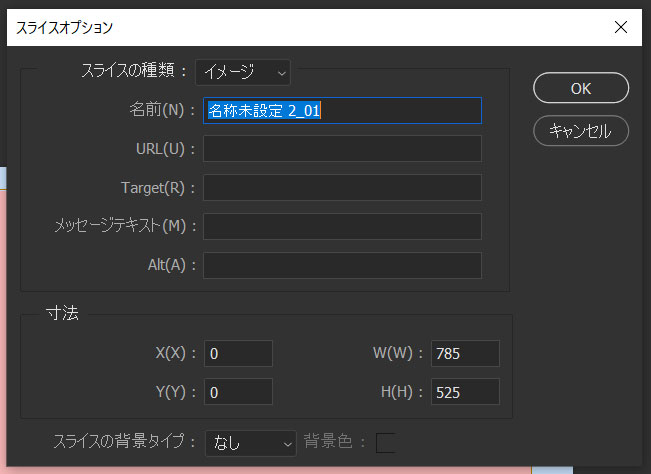

ここで変更するのは「名前(N)」の欄のみです。 
この欄に入れた名前がそのまま保存時の名前になります。「rectangle」という名前を付けてOKを押しましょう。

これで書き出しの準備が整いました。「Ctrl（⌘） + Alt（option） + Shift + S」を押して「web用に保存」のウィンドウを開きます。

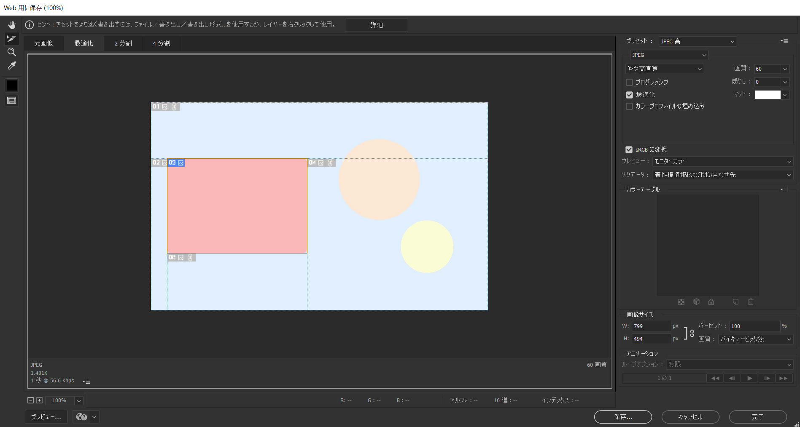

ウィンドウの詳細については後ほど詳しく解説します。

右上の「プリセット」の下の欄がJPEGになっているのを確認して、問題なければ右下の「保存」を押して書き出しましょう。

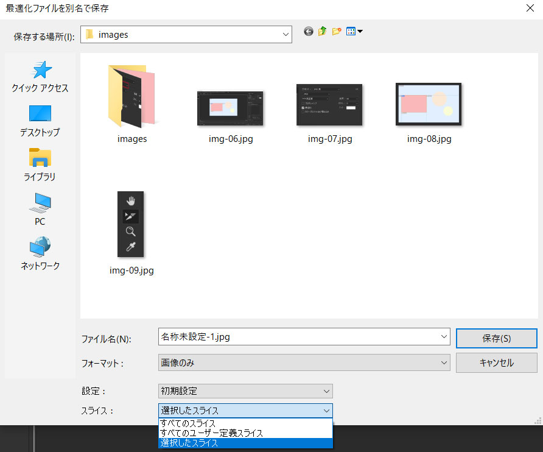

保存用のウィンドウが開きますが、スライスの設定を「選択したスライス」にしましょう。 
「全てのスライス」だと、自動生成されたスライスも全て書き出されてしまいます。 
保存を押すと、保存左記に選択したディレクトリの「images」ディレクトリに画像が保存されます。

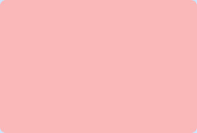

上手く書き出せましたか？ 次は2つの円を纏めて1枚画像として書き出してみましょう。

最初の画像を思い返してみると、長方形のようにささっとドラッグしてスライスを書き出せるようには思えません。 
ここで、ガイドラインを引いてみましょう。

#### ガイドラインの引き方

ガイドラインは、画像やテキストを綺麗に配置するためのものです。ガイドを引くには定規を表示します。 
「Ctrl(⌘)+R」を押しましょう。下の画像のように、定規が出れば準備はOKです。

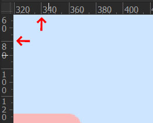

まずは、オレンジの円を選択してガイドラインを引きます。 
定規の上にカーソルを乗せてドラッグするとガイドラインを引くことが出来ます。 
楕円のバウンディングボックスに沿って写真のようにガイドを引きましょう。

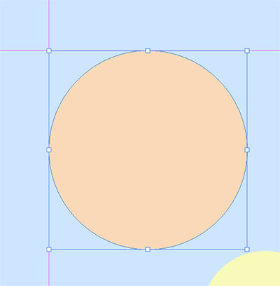

上手く引けたら、黄色の円にもガイドを引きます。

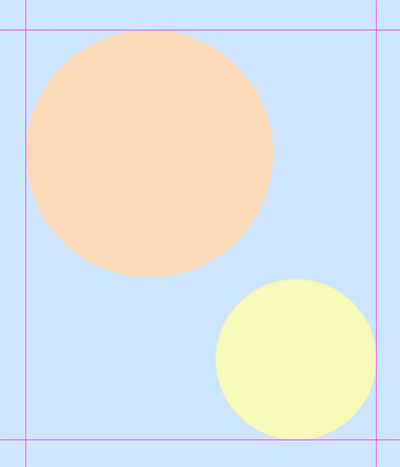

全部引いたらスライスツールに切り替えてガイドラインに沿ってスライスします。 
ガイドラインに近づくとカーソルがガイドラインにピタッとくっつくはずです。 
スライス出来たら長方形と同じく名前を付けて書き出しましょう。

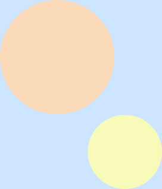

### jpg以外で書き出す場合
以上がスライスの使い方ですが、時にはjpg以外の拡張子で書き出したり、透過で書き出したい場合もあります。 
単に拡張子を変えるだけであれば、web用に保存のウィンドウで拡張子を変更するだけで済むのですが、 厄介なのが*透過で書き出す*場合です。

先ほどの「circles」を透過pngで書き出したいと思います。

web用に保存でpngを選択すると「透明部分」の項目があります。これにチェックを入れれば透過で保存できそうですが、 
なんと、透過で保存出来ません。

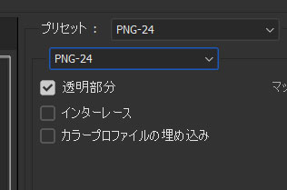

「透明部分」の項目は、画像を透過で保存する場合にはチェックを入れる必要がありますが、>思い通りに保存するには もうひと手間加える必要があります。

スライスは、スライスツールで作成した範囲をそのまま書き出してしまいます。なので、この円たちは水色の背景と一緒に書き出されてしまいました。 
透過で書き出すために、まずはレイヤーパネルから「背景レイヤー」を非表示にしましょう。

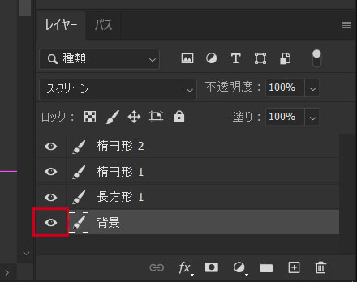

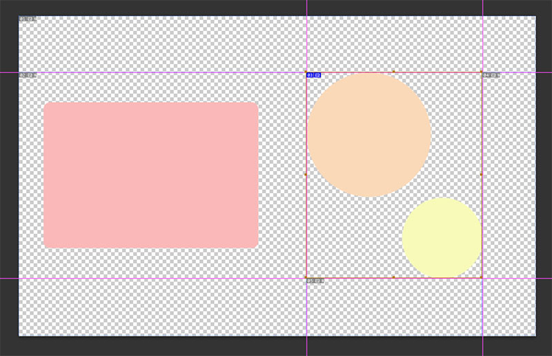

この状態でもう一度pngで保存しましょう。

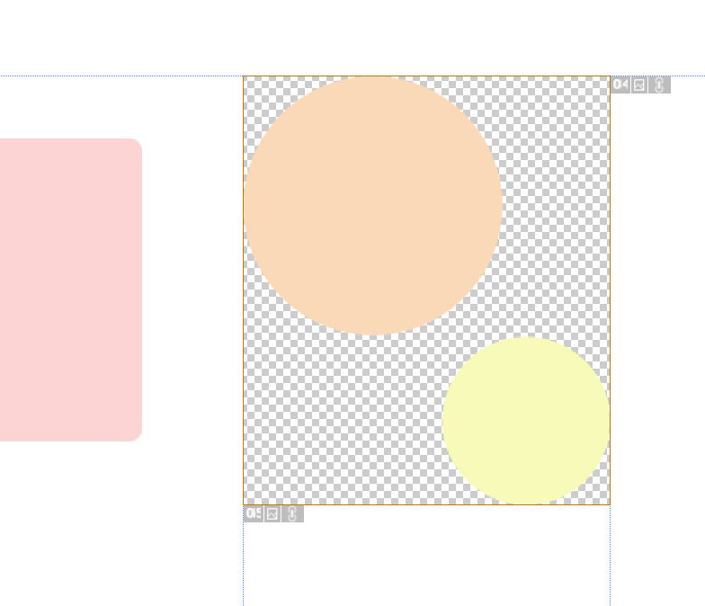

今度は上手く書き出せました。 
これで透過で書き出す方法もばっちりです。

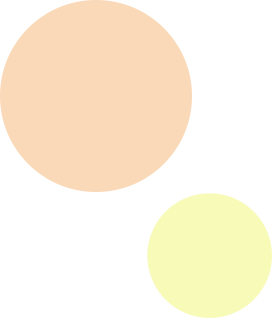

## 【補足】「web用に保存」ウィンドウの解説

「web用に保存」ウィンドウでは、書き出し時の様々な設定を行う事が出来ます。

### 画像形式の選択

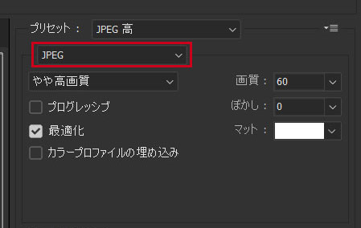

まずは右上。 
赤枠内から書き出す拡張子を選択します。「プリセット」では画質等を設定する事が出来ます。 
今選択されている「JPEG 高」は「jpegの最高画質」です。

### ツール

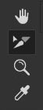

次に左上のツールです。 
上から「手のひらツール」「スライス選択ツール」「ズームツール」「スポイトツール」です。 
色々ありますが、この部分はショートカットキーを使えば切り替えられるので基本的には使いません。

手のひらツールは100％以上ズームした画像をドラッグする事で、表示部分を移動する事が出来ます。 
このツールはスペースキーを押したままでも使用出来ます。

スライス選択ツールは、書き出したいスライスを選択するのに使います。 
「web用に保存」のウィンドウを開いた時点ではこのツールが選択されています。

ズームツールは画面の拡大・縮小に使います。 
「Alt(option)+マウスホイールの前後操作」でも代用出来ます。

スポイトツールに関しては、なぜここにいるのか私には理解できていません。

### アートボード部分

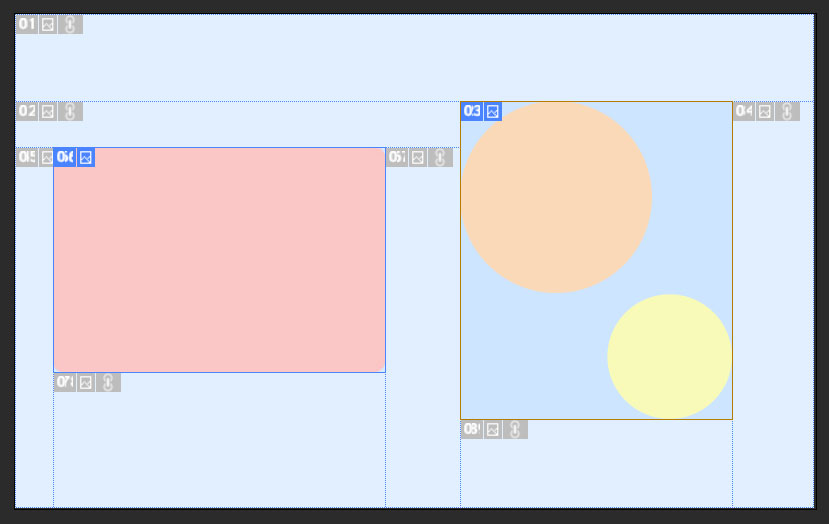

中央のアートボード部分では、書き出すスライスを選択出来ます。 
分かり辛いですが、選択されていないスライスは薄く表示されています。 
shiftを押しながら書き出したいスライスを選択する事で、複数の画像を同時に書き出す事が出来ます。（ただし、画像形式は統一されてしまいます）

## まとめ
今回は、画像のスライスについてでした。 
スライスは書き出し範囲がイメージしやすかったり、自由な範囲で画像を書き出す事が出来ますが、透過で書き出したい場合はレイヤーを非表示にしたりと少々手間が掛かってしまいます。 
次回紹介するアセットでは、どんな形式でも簡単にガシガシ書き出す事が出来ます。 

次回もお楽しみに！！
