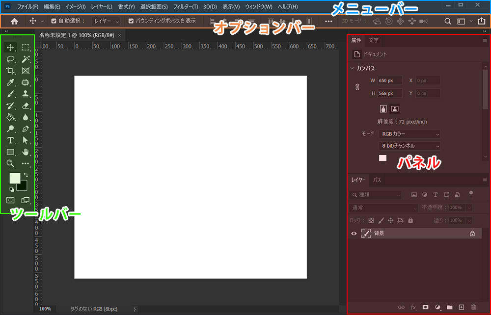
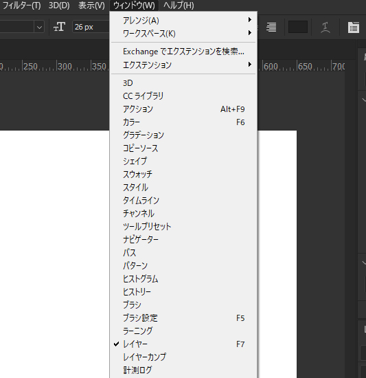

## 画面の見方

### メニューバー
「操作設定」、「表示設定」、「画像加工」等の基本操作を行う為のツールが入っています。 
基本的な操作はショートカットを使わずともメニューバーの項目から操作できます。

### オプションバー
使用しているツールの詳細設定を行うことが出来ます。 
移動ツールならオブジェクトを揃える方向、切り抜きツールなら切り抜く比率など、ツールによって表示される項目が変わってきます。

### ツールバー
「移動ツール」、「長方形選択ツール」、「文字ツール」等、各種ツールが入っています。 
よく使うツールのコマンドを覚えると。作業時間をかなり短縮できる上に、カッコいいです。多分。

### パネル
画像の詳細設定や、レイヤー、カンバスの情報等様々な操作を行うことが出来ます。 
ここに必要なパネルが無い場合、メニューバーの*ウィンドウ*から必要なパネルを選択することで表示させることが出来ます。

## 今回のまとめ
今回はPhotoshopの画面の見方についての記事でした。 
それぞれのツールの細かい説明については、今後の記事で紹介していく予定です。

